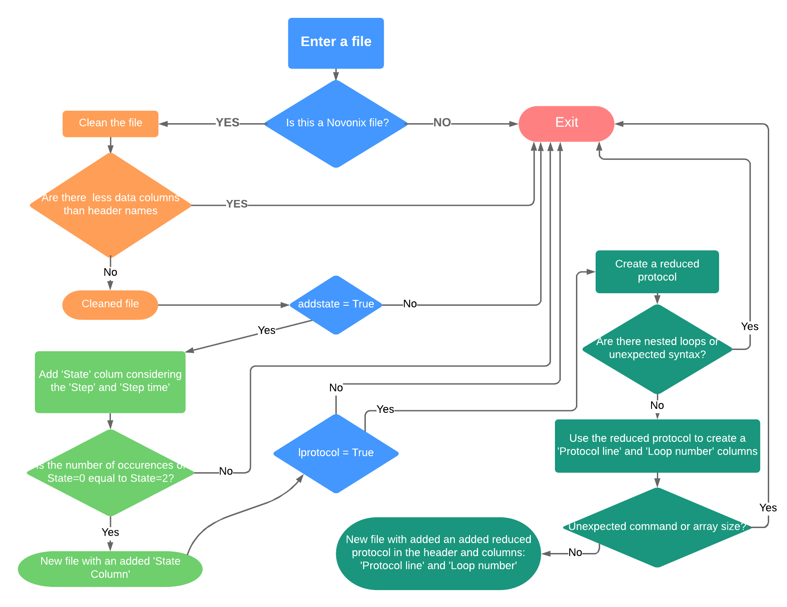

.. _features:
Code Features
=============

The `preparenovonix`_ package prepares exported files produced by
`Novonix`_ battery-testers (or ’Novonix files’) by (i) cleaning them and (ii) adding
derived information to the file. The package also allows reading a
column given its name. The list of functions available in the package
can be found below in alphabetical order. This functions are presented
with the expected input parameters in brackets and further details are
given here for some of them and otherwise go to the `module index`_ for full details and examples of usage.

-  ``cleannovonix(infile)``: Given a ’Novonix file’ clean it as it is
   described below.

-  ``isnovonix(infile)``: Given a file, check if it is or not a ’Novonix
   file’.

-  ``icolumn(infile,column_name)``: Given the name of a column, find the
   position of this column within a cleaned ’Novonix file’.

-  ``novonix_add_loopnr(infile,verbose=False)``: Given a cleaned
   ’Novonix file’, add a reduced protocol to the header and the columns
   ’Protocol line’ and ’Loop number’.

-  ``novonix_add_state(infile,verbose=False)``: Given a cleaned ’Novonix
   file’, add the ’State’.

-  ``prepare_novonix(infile,addstate=False,lprotocol=False,``\ ``overwrite=False,verbose=False)``:
   Master function of the package that can call the cleaning and adding
   derived information functions directly. This function follows the
   flow chart presented in the :ref:`chart`. Running all the
   available features from the `preparenovonix`_ package can take form
   few seconds to up to few minutes depending on the size of the input
   file.

-  ``read_column(infile,column_name,outtype=’float’)``: Given a column
   name, read it from a cleaned ’Novonix file’ as a numpy array of the
   type given in ``outtype``.

-  ``reduced_protocol(infile,verbose=False)``: Given a cleaned ’Novonix
   file’, generate a reduced protocol.

-  ``select_com_val(index)``: Auxiliary function of
   ``novonix_add_loopnr``.

As it is shown in the :ref:`chart`, the derived information
is only added on ’cleaned’ files and only files that the code considers
as ’Novonix files’ can be cleaned. The master function
``prepare_novonix`` allows the user to call either the cleaning process
or the addition of extra columns ensuring that the dependencies
previously defined are taken into account. This function requires as
input parameters: the path to a file and four boolean optional
parameters. These boolean parameters are: ``addstate``, ``lprotocol``,
``overwrite`` and ``verbose``. The last parameter provides the option to
output more information about the run. If the ``overwrite`` parameter is
set to False, a new file will be generated with a name similar to the
input one, except for the addition of ``_prep`` before the extension of
the file.

.. _chart:

Flow chart
----------

   Flow chart for the ``prepare_novonix`` function. Besides the name of the input file, this function has four optional boolean input parameters: ``addstate``, ``lprotocol``, ``overwrite`` and ``verbose``. The last two parameters are not included in the flow chart, but they are described in the text. In this chart rectangle shapes indicate a process, rounder rectangles the end of a process and diamonds a decision. Note that for simplicity not all the decisions made in the code are shown here.

The ``isnovonix`` function
--------------------------
The function ``isnovonix`` decides if a file has the expected structure
(including a full header) for an exported file produced by the Novonix
battery-testers (or ’Novonix files’). If the file is lacking the header
or if it has not been exported with a Novonix battery-tester using the
covered software (see section ’Quality control’), the code will exit
with an error message and without generating a new file.

The ``cleannovonix`` function
-----------------------------
The function ``cleannovonix`` produces a new ’Novonix type’ file after
performing the following tasks:

-  Delete failed tests within one file, adding the final capacity of all
   failed tests to the capacity column of the finished test.

-  Remove blank lines from the header.

-  Remove eventual trailing characters from the header produced when the
   file was previously open with certain programs, such as Excel.

-  Add a dummy header name (``dum[number]``) for each data column
   lacking a header name.

The ’State’ column
------------------
A ’State’ column can be added to a cleaned Novonix file by calling the
function ``novonix_add_state`` or setting to True the parameter
``addstate`` when calling the function ``prepare_novonix``. This ’State’
column can have the following values:

-  0 for the first measurement of a given type (for example, a constant
   current charge).

-  1 for measurements between the first and last of a given type.

-  2 for the last measurement of a given type.

-  -1 for single measurements. This can happen under different
   conditions. A type of measurement can end after a single measurement
   when some conditions are met (this usually happens while the time
   resolution is coarse). At times, the current can overshoot from
   negative to positive values at the beginning of a measurement. A bug
   in the Novonix software that locks certain values, etc. If two single
   measurements happen together, the two lines are discarded in the new
   file containing the additional ’State’ column.

The ’State’ column is generated based on the quantities provided in
’Novonix files’: ’Step’ (integer indicating the type of measurement) and
’Step time’ (time that resets to 0 each time a new type of measurement
starts).

The ``reduced_protocol`` function
---------------------------------
The ``reduced_protocol`` function reads the complete header from the
input file and generates (or reads) the reduced protocol. This function
returns the reduce protocol itself and a boolean flag, ``viable_prot``.
The reduced protocol consist of an array of strings. Each string
contains a line of the experimental protocol with a structure as
follows: line number,’:’,command,’:’,trip conditions. An example:
``[4 : Repeat 49 times :]``. Only commands referring to the following
processes will appear in the reduced protocol (note that commands that do not produce measurements are ignored here):

-  Open circuit storage (or rest)

-  Constant current (dis)charge

-  Constant current - Constant Voltage (dis)charge

-  (End) Repeat

The reduced protocol is tested against the number of unique measurements
in the file, determined using the column ’State’. If the number of
measurements expected from the protocol is less than the actual number
of measurements, the flag ``viable_prot`` is set to false, indicating
that the construction of the reduced protocol was not viable.

The ’Protocol line’ and ’Loop number’ columns
---------------------------------------------
The ’Protocol line’ and ’Loop number’ columns can be generated by either
calling directly the function ``novonix_add_loopnr`` or by setting to
True the parameter ``lprotocol`` when calling the function
``prepare_novonix``. The column ’Protocol line’ associates a measurment
with the its corresponding line in the reduced protocol previously
produced. The ’Loop number’ column has a value of 0 if a measurement
does not correspond to any repetition statement in the protocol and
otherwise it grows monotonically with each repetition.

If the flag ``viable_prot`` was set to false by the ``reduced_protocol``
function, the ’Protocol line’ and ’Loop number’ columns are populated
with the value -999.

.. _preparenovonix: https://github.com/BatLabLancaster/preparenovonix

.. _Novonix: http://www.novonix.ca/

.. _module index: https://prepare-novonix-data.readthedocs.io/en/latest/py-modindex.html
